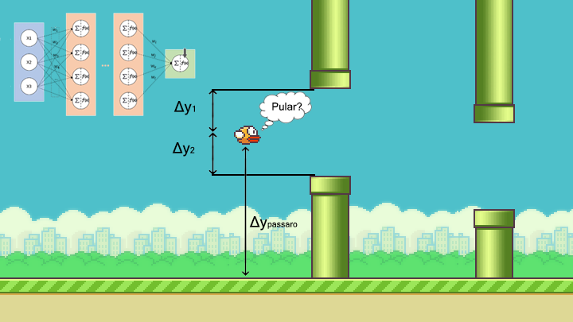

# Machine Learning for Flappy Bird usando Rede Neural e Algotmo Genético

As seguintes dependências são necessárias para a execução do jogo:

1. pygame
2. Python3.9+
3. neat-python
4. matplotlib
5. graphviz

Para instalar as dependências, faça `pip3 install -r requirements.txt`

Para as visualizações de resultados é imprescindivel a instalação dos pacotes Graphviz de acordo com o SO, mais informações podem ser encontradas <a href=https://graphviz.org/download/> aqui </a>:

## Arquitetura da Rede Neural

Para jogar o jogo, cada indivíduo (pássaro) possui sua própria rede neural composta pelas próximas 2 camadas:

1. Uma camada de entrada com 3 neurônios representando o que um pássaro vê

```
 1) distância vertical entre o pássaro e o chão
 2) distância vertical entre o pássaro e o cano superior
 3) distância vertical entre o pássaro e o cano inferior.
```

<center>

</center>

2. A camada oculta, que pode aumentar ou diminuir aleátoriomente de acordo com necessidade do NEAT.

3. Uma camada de saída com 1 neurônio usado para fornecer uma ação da seguinte forma:

```python
if out > 0.7:
     passaro.pular()
else:
    não faz nada
```

# referencias

- https://neat-python.readthedocs.io/en/latest/
- https://www.youtube.com/watch?v=MMxFDaIOHsE&ab_channel=TechWithTim
- https://www.youtube.com/watch?v=GMDb2jtzKZQ&t=1514s&ab_channel=HashtagPrograma%C3%A7%C3%A3o
- https://medium.com/analytics-vidhya/how-i-built-an-ai-to-play-flappy-bird-81b672b66521
